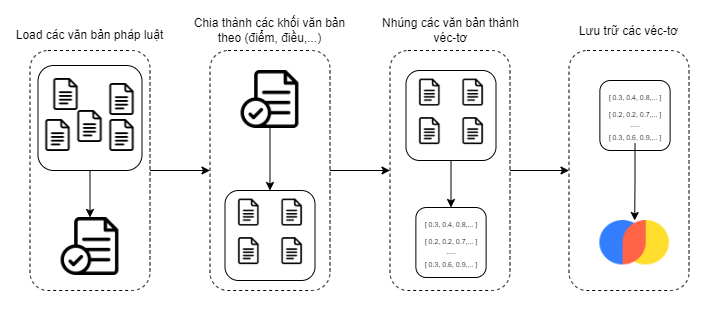
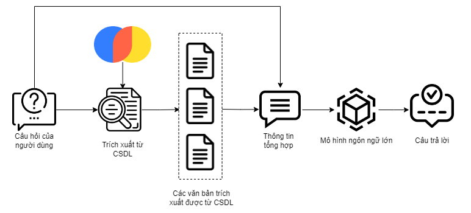

# 📜 Legal QA Service

**Chào mừng đến với Service giúp bạn khám phá thế giới pháp lý chỉ bằng câu hỏi!** Từ việc nhúng các văn bản pháp luật thành véc-tơ để lưu trữ hiệu quả cho đến việc trả lời những thắc mắc pháp lý, Service này đảm bảo cung cấp những câu trả lời chính xác và nhanh chóng dựa trên các văn bản pháp luật liên quan.

## 🌟 Các chức năng chính

### 1. Nhúng và Lưu trữ Văn Bản Pháp Luật
- **Nhúng Véc-tơ**: Sử dụng mô hình `Sentence-Transformers` từ HuggingFace để nhúng các văn bản pháp luật thành véc-tơ giúp lưu trữ và truy xuất nhanh chóng.
- **Lưu trữ**: Sử dụng `ChromaDB` để lưu trữ các véc-tơ từ văn bản pháp luật đã nhúng, đảm bảo khả năng tìm kiếm hiệu quả.

### 2. Trả Lời Câu Hỏi
- **Truy Xuất Thông Tin**: Trích xuất thông tin liên quan từ `ChromaDB` dựa trên câu hỏi của người dùng.
- **Tổng Hợp Câu Trả Lời**: Kết hợp câu hỏi với văn bản pháp luật trích xuất hoặc chỉ định để tạo ra câu trả lời chi tiết.
- **Mô Hình Ngôn Ngữ Lớn (LLM)**: Đưa thông tin tổng hợp kết hợp giữa câu hỏi của người dùng và văn bản được truy xuất từ `ChromaDB` vào mô hình ngôn ngữ lớn để sinh ra câu trả lời chính xác và phù hợp nhất cho người dùng pháp luật.

---

## 🏛️ Hệ Thống Lưu Trữ Văn Bản Pháp Luật

Dưới đây là thiết kế cho hệ thống lưu trữ văn bản pháp luật (như mô tả hình ảnh):


## 🤖 Hệ Thống Hỏi Đáp

Thiết kế của hệ thống hỏi đáp:


---

## 🔧 Cài đặt

Trước khi khởi chạy, hãy đảm bảo bạn đã cài đặt các thư viện cần thiết:
```bash
pip install -r requirements.txt
```
### 1. **Cấu Hình Đường Dẫn**
Đầu tiên, chúng ta cần cấu hình các biến môi trường trong file .env:
```txt
TOPIC_DB_PATH : Thư mục lưu các vector embedding
DOCS_PATH : Thư mục lưu trữ data để tạo các vector
ST_MODEL_PATH : mô hình tạo vector dữ liệu văn bản
QA_MODEL_PATH : mô hình trả lời câu hỏi
ACCESS_TOKEN_KEY : token của Hugging Face
HF_INFERENCE_API : Hugging API URL
API_KEY: API Key của Gemini
```

### 🛠️ Nhúng Văn Bản Pháp Luật

Với Window:
```bash
python vectorize_corpus.py
```

Với Linux, MacOS:
```bash
python3 vectorize_corpus.py
```
---

### 🚀 Khởi Chạy Service Hỏi Đáp

Với Window:
```bash
python app.py
```
Với Linux, MacOS:
```bash
python3 app.py
```


## 📬 Liên Hệ

Nếu bạn có bất kỳ câu hỏi, phản hồi hoặc cần hỗ trợ, vui lòng liên hệ với chúng tôi qua:

- Phạm Đình Tiến: phamdt203@gmail.com
- **Số điện thoại**: +84 393 725 596
- **Website**: [www.phamdt203.github.io](https://www.phamdt203.github.io)
- **Github Issues**: Nếu gặp sự cố hoặc muốn đóng góp ý kiến, hãy tạo vấn đề mới trên [trang GitHub của chúng tôi](https://github.com/username/legalqa).

---